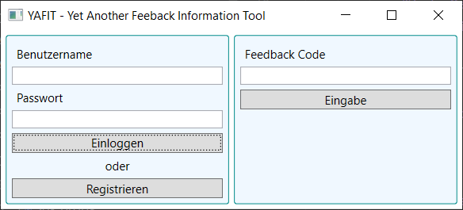
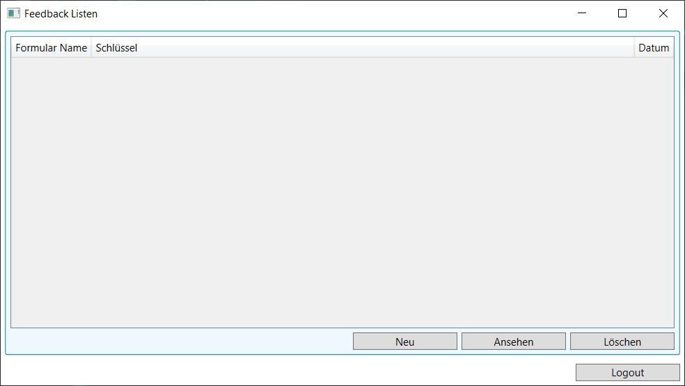
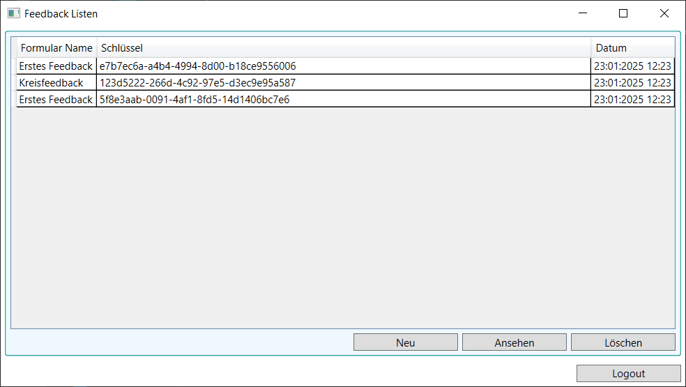
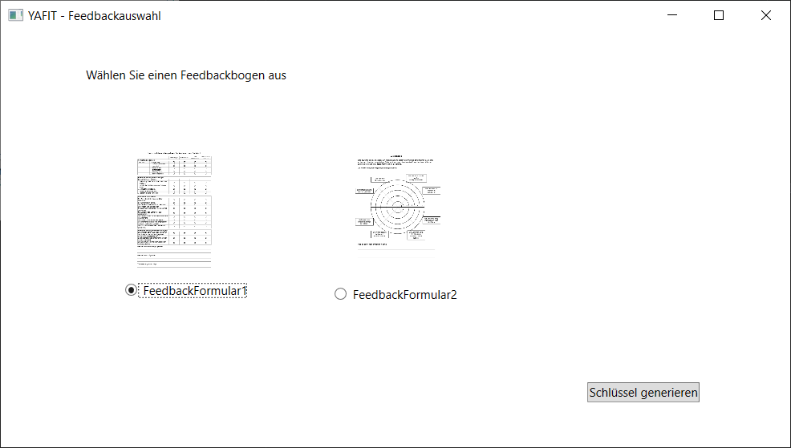
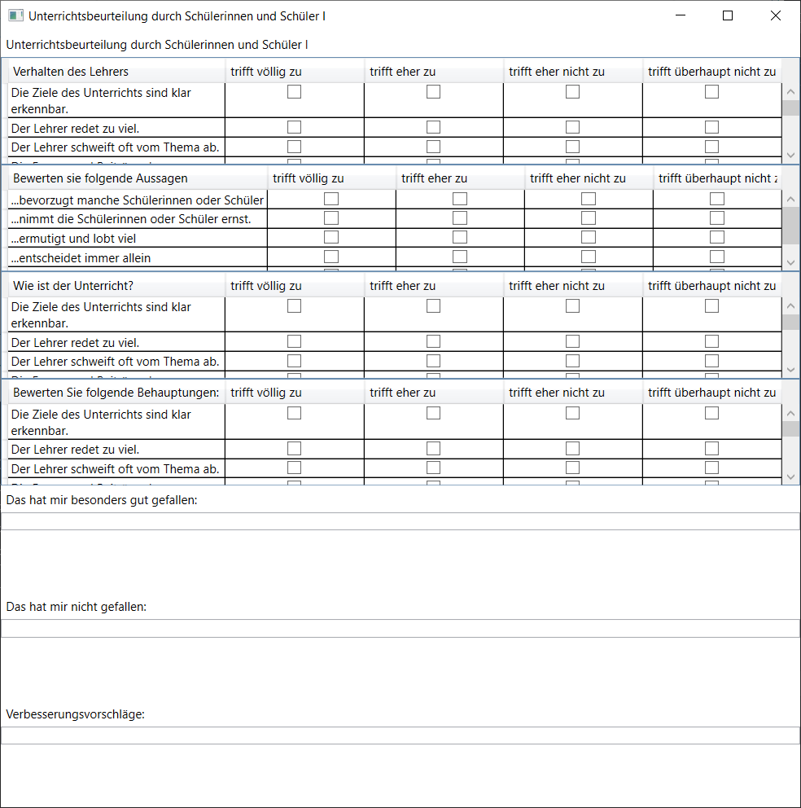

# YAFIT

YAFIT (**Y**et **a**nother **f**eedback **i**nformation **t**ool) ist ein Tool für Lehrkräfte um von ihren Schüler:innen anonym Feedback zu erhalten.

YAFIT ist eine WPF-App und setzt mindestens Windows 10 vorraus.

## Installation

## Benutzung

### Anmeldung/Registrierung

Zur Anmeldung und Registrierung muss ein Benutzername und Passwort angegeben und dann auf den entsprechenden Button gedrückt werden.

### Bestehende Feedback-Bögen verwalten

 

Für einen angemeldeten Benutzer ist die Liste seiner Fragebögen zu sehen. 
Der Schlüssel für Schüler ist der Mitte zu entnehmen.

### Neuen Feedback-Bogen anlegen

Nach einem Klick auf "Neu" kann man einen der Feedback-Bögen auswählen. Bei Klick auf "Schlüssel generieren" wird für diesen Feedback-Bogen ein neuer Schlüssel generiert und in die Liste geschrieben.

### Feedback-Bogen betrachten

Bei Doppelklick auf ein Formular wird dieses geöffnet.

## Lizenz

YAFIT ist [freie Software](https://de.wikipedia.org/wiki/Freie_Software).

YAFIT wird unter der GNU General Public License v3.0 veröffentlicht.